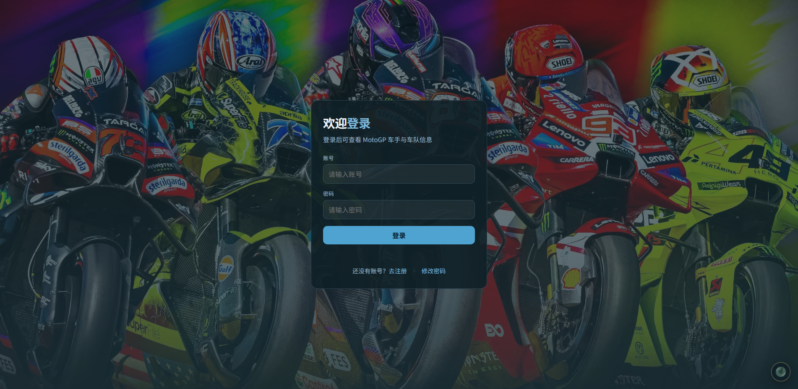
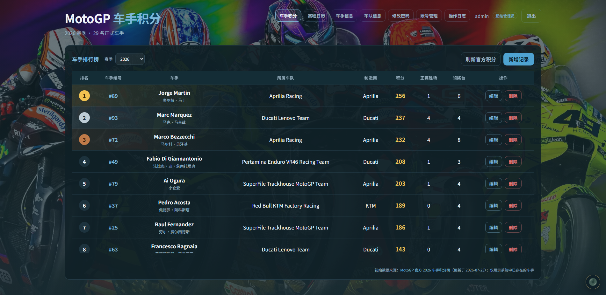
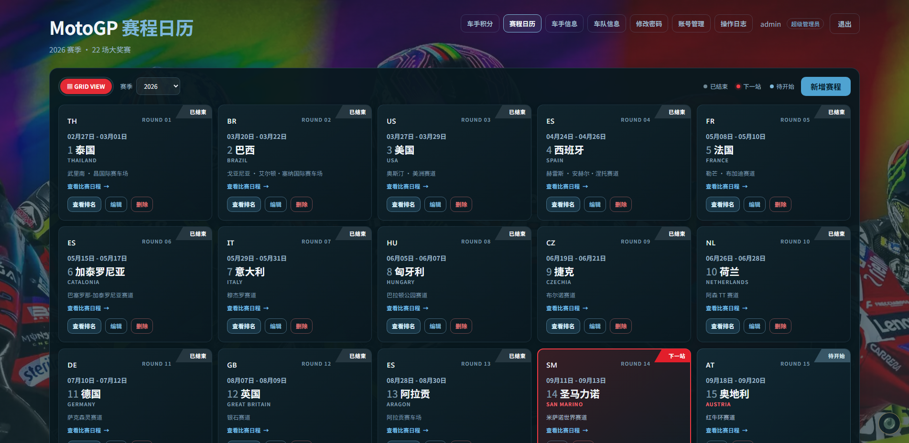
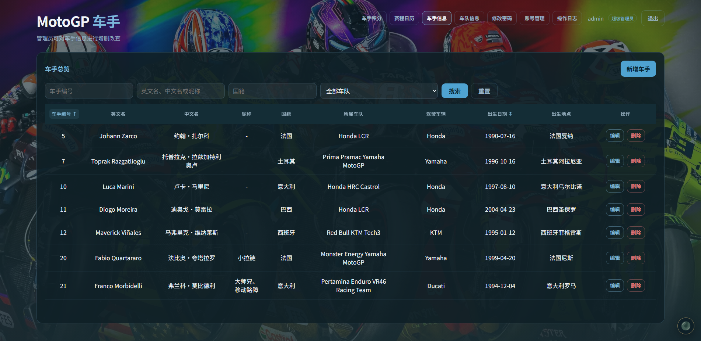
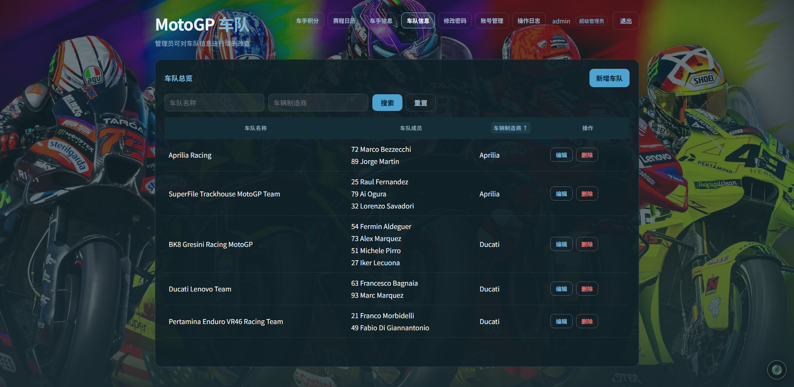

# MotoGP 信息管理系统

一个基于 Flask、MySQL 和原生 HTML/CSS/JavaScript 的 MotoGP 信息管理系统。系统提供车手积分、赛程日历、分站赛程与排名、车手和车队资料、账号权限以及操作日志等功能，并支持管理员从 MotoGP 官方数据接口手动同步公开赛事数据。

> 本系统由 AI 辅助开发，主要目的是通过完整项目实践熟悉 AI 开发流程，包括需求沟通、功能实现、问题排查、代码优化和项目整理等环节。

## 主要功能

- 2026 赛季车手积分榜，以及受频率限制的管理员手动同步
- 网格化赛程日历、分站详细 Schedule、冲刺赛与正赛排名
- 车手和车队资料的搜索、排序、增删改与并发修改保护
- 新增表单草稿暂存、表格内滚动和响应式布局
- 用户注册、登录、退出、无需登录修改密码和账号权限管理
- 车手、车队与账号操作日志，以及分页、筛选和自动保留策略
- 跨页面连续播放的背景音乐与悬浮音量控制

## 界面预览

### 登录界面



### 车手积分榜



### 赛程日历



### 车手信息



### 车队信息



## 项目结构

```text
motogp-management-system/
├─ backend/
│  ├─ app.py            # Flask 应用、页面入口和 API 路由
│  ├─ config.py         # 环境变量与运行配置
│  ├─ db.py             # MySQL 表结构、查询和数据写入
│  └─ motogp_sync.py    # MotoGP 官方公开数据同步逻辑
├─ docs/
│  └─ screenshots/      # README 使用的系统界面截图
├─ frontend/
│  ├─ assets/
│  │  ├─ audio/         # 背景音乐
│  │  ├─ css/           # 公共样式
│  │  ├─ images/        # 背景图、站点图标和音乐图标
│  │  └─ js/            # 页面逻辑与公共 API 封装
│  └─ *.html            # 各业务页面
├─ .env.example         # 环境变量模板
├─ .gitignore
├─ README.md
└─ requirements.txt
```

## 本地运行

需要 Python 3.10+ 和 MySQL 8.0+。

1. 创建并激活虚拟环境：

   ```powershell
   python -m venv .venv
   .\.venv\Scripts\Activate.ps1
   ```
2. 安装依赖：

   ```powershell
   pip install -r requirements.txt
   ```
3. 复制配置模板并填写本机数据库密码、随机 Session 密钥和初始管理员密码：

   ```powershell
   Copy-Item .env.example .env
   ```
4. 启动应用：

   ```powershell
   python backend\app.py
   ```
5. 访问 `http://127.0.0.1:5000`。首次启动会自动创建数据库表和配置的初始管理员账号。

## 配置说明

真实配置存放在 `.env`，该文件已被 `.gitignore` 排除。公开仓库中不要提交数据库密码、Session 密钥或真实管理员密码。部署环境应至少修改：

- `MYSQL_PASSWORD`
- `SECRET_KEY`
- `ADMIN_PASSWORD`
- `FLASK_DEBUG=false`

同步相关冷却时间默认均为 3600 秒，可通过 `.env` 调整。请合理控制对第三方公开接口的访问频率，并在正式使用前自行确认其最新服务条款。

## 数据说明

MySQL 中的业务数据不会自动包含在 Git 仓库中。源码能够创建表结构并初始化基础赛程，但现有账号、操作日志及后续同步或编辑的数据仍保存在本机 MySQL。迁移环境时应通过受保护的数据库备份单独迁移，且不要把包含账号信息的数据库导出文件提交到公开仓库。

## 上传 GitHub 前

提交前建议执行：

```powershell
git status --short
git check-ignore .env
```

确认 `.env` 显示为已忽略，并检查暂存文件中没有密码、Cookie、数据库备份或私人日志。本项目目前未附带开源许可证；公开发布前请根据你的使用方式选择合适的许可证。
